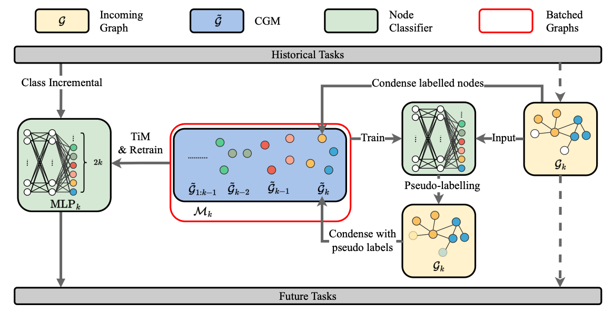
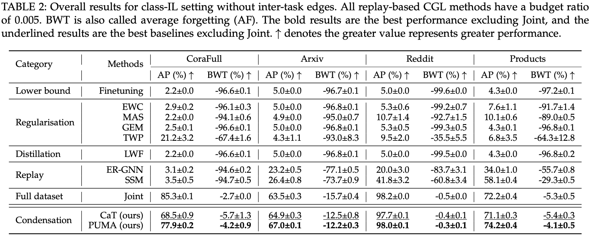

# PUMA (Continual Graph Learning)
This is the official repository for the paper [PUMA: Efficient Continual Graph Learning with Graph Condensation](https://arxiv.org/abs/2312.14439) which is an extension of [CaT: Balanced Continual Graph Learning with Graph Condensation](https://arxiv.org/abs/2309.09455) ([code](https://github.com/superallen13/CaT-CGL)).

The following figure shows the PUMA framework in details.


# Main experiment results.


# Experiment environment
Our experiments are run on the enviroment based on `Python 3.8` with the following packages:

```
pytorch==1.13.0
torch-geometric==2.2.0  # for deploying GNNs.
ogb==1.3.6  # for obtaining arxiv and prodcuts datasets.
progressbar2==4.2.0  # for visulasing the process of the condensation.
```

# Usage
To reproduce the results of Table 2 (classIL setting), please run the `table2.sh` in the `srcripts` folder:
```
run .\srcripts\table2.sh
```

# Cite
If you find this repo useful, please cite

```
@inproceedings{CaT,
  author    = {Yilun Liu and
               Ruihong Qiu and
               Yanran Tang and
               Hongzhi Yin and
               Zi Huang},
  title     = {PUMA: Efficient Continual Graph Learning with Graph Condensation},
  journal   = {CoRR},
  volume    = {abs/2312.14439},
  year      = {2023}
}
```

# Credit
This repository was developed based on the [CGLB](https://github.com/QueuQ/CGLB) and [CaT](https://github.com/superallen13/CaT-CGL).